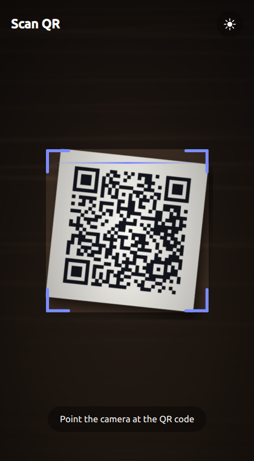
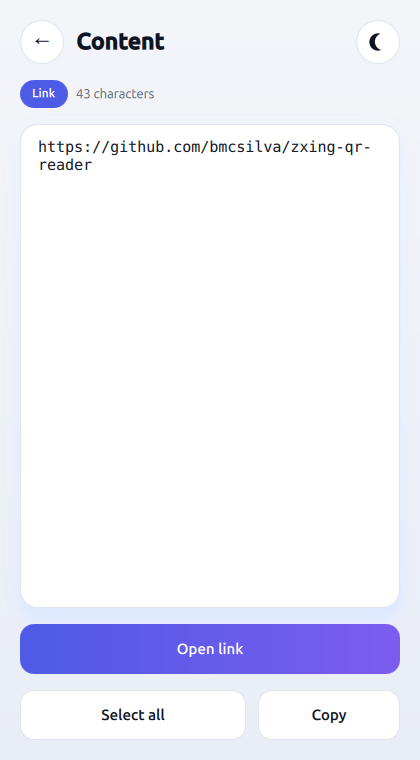
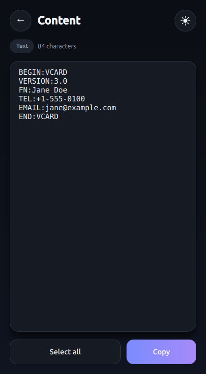

<p align="center">
  
</p>

<h1 align="center">zxing-qr-reader</h1>

<p align="center">
  A QR-code reader for Android, iOS, Windows, Linux and macOS, built with
  Qt 6 / QML and the ZXing decoder.<br>
  It shows what it read <b>in full, never truncated</b>, so you can select it,
  copy it, or open it as a link.
</p>

<p align="center">
  
  
  
  
</p>

<table align="center">
  <tr>
    <td></td>
    <td></td>
    <td></td>
  </tr>
  <tr>
    <td align="center">Point and scan</td>
    <td align="center">Links open in one tap</td>
    <td align="center">Long content, shown whole</td>
  </tr>
</table>

## Download

Ready-to-run packages are on the
**[latest release](https://github.com/bmcsilva/zxing-qr-reader/releases/latest)**:

| Platform | File | Notes |
|---|---|---|
| Windows 10/11 (64-bit) | `QrReader-<ver>-win64.exe` (installer)<br>`QrReader-<ver>-win64.zip` (portable) | Not code-signed: SmartScreen warns on first run → *More info* → *Run anyway*. |
| macOS 13+ (Apple Silicon and Intel) | `QrReader-<ver>-macos.dmg` | Not notarized: the first launch is blocked → *System Settings → Privacy & Security* → *Open Anyway*. |
| Linux (Ubuntu 22.04+ and similar) | `QrReader-<ver>-x86_64.AppImage` | `chmod +x` it and run it. |
| Android 9+ (64-bit ARM) | `QrReader-<ver>-android-arm64.apk` | Allow your browser or file manager to install apps. |

There is no iOS download: installing outside the App Store needs a build signed
for your own device (see [Building for iOS](#building-for-ios)).

## Features

- **The whole value, never cut off.** The decoded text sits in a scrollable,
  selectable box, with a character count.
- **Links and text.** An `http(s)` URL gets a *Link* tag and an *Open link*
  button; anything else (Wi-Fi config, vCard, plain text) gets *Select all* and
  *Copy*.
- **Light and dark.** Follows the system theme; the sun/moon button switches
  between the two.
- **Translated** into Portuguese (Portugal), Spanish, French and British
  English, picked from the device language.
- **Easy on the battery.** Decodes about four frames per second, which is
  plenty for an instant read.

## Build and run

Needs **Qt 6.10+** (with the **Multimedia** module), **CMake 3.28+** and a
**C++20** compiler.
ZXing is fetched automatically on the first configure (needs network access),
from the [bmcsilva/zxing-cpp](https://github.com/bmcsilva/zxing-cpp) fork.
Developed and built on **Ubuntu 24.04**.

`qt-cmake` lives in your Qt kit and isn't on the PATH, so use the
[build.sh](build.sh) wrapper — it points at the right kit and runs the
configure + build steps for you:

```bash
./build.sh              # debug build, in build-debug/
./build.sh release      # release build, in build-release/
./build.sh debug run    # build, then launch
```

The script picks the newest kit it finds under `~/Qt` for the platform you are
building for. To use a different one, point it there explicitly:
`QT_DIR=~/Qt/<ver>/gcc_64 ./build.sh` (or set `QT_BASE` if your Qt versions
don't live in `~/Qt`).

For **Android**, open the folder in **Qt Creator**, pick an Android kit, and
Run. The app needs **Android 9** (API 28) or newer.

## Trying it without a camera

Debug builds have two ways to show the result screen with no QR code in front of
the lens:

- **F5** fakes a scan. Each press shows the next sample value (a link, a Wi-Fi
  config, a vCard) without going through the decoder.
- **`--scan-file <image or video>`** plays a file into the viewfinder instead
  of the camera, on a loop, so the real ZXing decoder reads it.
  [docs/sample-qr.png](docs/sample-qr.png) is a QR code for this repo lying on
  a desk; it is what the screenshots above were taken with:

  ```bash
  ./build-debug/qrreader --scan-file docs/sample-qr.png
  ```

  `build.sh run` does not pass arguments through, so launch the binary directly
  (on macOS: `build-debug/qrreader.app/Contents/MacOS/qrreader`). This was
  tested on Linux, where Qt's FFmpeg backend also accepts a still image. Apple
  builds use the AVFoundation backend instead (see below), so use a video there.

## Building on macOS

On a fresh Mac, [setup-macos.sh](setup-macos.sh) installs the whole toolchain
(Homebrew, CMake, Ninja, `aqt`) and Qt with the Multimedia module — then `build.sh`
works exactly as on Linux (it auto-detects the `~/Qt/<ver>/macos` kit):

```bash
./setup-macos.sh        # one-time environment setup (skips what's present)
./build.sh              # debug
./build.sh release run  # release, then launch qrreader.app
```

The setup script needs **Xcode 16 or newer** already installed from the App
Store. `xcode-select --install` only gives the command-line tools, but ZXing
needs a full recent Xcode: older Xcode 15.x ships a Clang without C++20
*parenthesized aggregate initialization* and fails to compile ZXing with
`no matching function for call to 'construct_at'`.

Prefer to install Qt yourself (e.g. via the Qt online installer)? Make sure the
**Multimedia** module is included. If Qt's own `cmake` and `ninja` are installed
under `~/Qt/Tools` (the case on a machine set up with Qt Creator), `build.sh`
puts them first on the PATH, so they are used even when the system has its own.

Apple-specific behaviour, handled in [CMakeLists.txt](CMakeLists.txt):

- The app is built as a **`.app` bundle**. The default macOS file system is
  case-insensitive, so a bare `qrreader` binary would collide with the
  `QrReader/` QML module folder; the bundle (`qrreader.app`) avoids that and is
  the correct form for a GUI app.
- The **FFmpeg multimedia backend is excluded**; Apple builds use the native
  **darwin (AVFoundation)** backend. Qt's iOS package ships only the FFmpeg
  plugin stub without the FFmpeg libraries, which otherwise breaks the link with
  hundreds of undefined `_av_*` symbols.
- **Camera permission** is declared via a custom `Info.plist` carrying
  `NSCameraUsageDescription`; without it the OS terminates the app on first
  camera access. macOS and iOS need different keys, so they get one each:
  [platform/Info.macos.plist.in](platform/Info.macos.plist.in) and
  [platform/Info.ios.plist.in](platform/Info.ios.plist.in).
- The **bundle id** is `pt.bmcsilva.qrreader` (`MACOSX_BUNDLE_GUI_IDENTIFIER`).
  Change it to your own before shipping, and change `BUNDLE_ID` in
  [build.sh](build.sh) to match, or `./build.sh ios sim run` launches the wrong
  id.

## Building for iOS

`build.sh` drives the iOS build too (`INSTALL_IOS=1 ./setup-macos.sh` installs
the kit). It uses the Xcode generator, which is what produces the `.app` bundle
and compiles the launch storyboard:

```bash
./build.sh ios              # device build (unsigned), Debug
./build.sh ios release      # device build, Release
./build.sh ios simulator    # build against the simulator SDK
./build.sh ios sim run      # ... and install + launch it in the simulator
```

Because the iOS kit only ships the target libraries, the build also needs the
**desktop** kit for the host-side tools (`moc`, `rcc`, `qmlcachegen`);
`build.sh` finds it next to the iOS kit and passes it as `QT_HOST_PATH`. The
path baked into the kit at packaging time does not exist on your machine, so
without this the configure step fails.

Three more things have to be in place, or the build fails before it produces an
`.app`:

- **Signing, or the choice to skip it.** By default the build is left
  **unsigned** — enough to check that the code compiles, and what a build meant
  for sideloading with AltServer wants. To sign instead, pass a development
  team: `IOS_TEAM=ABCDE12345 ./build.sh ios release`. Sign in under *Xcode →
  Settings → Accounts* with any Apple ID first; a free personal team is enough
  for running on your own device.

- **Xcode's iOS platform component.** The iOS SDK alone is not enough: `ibtool`
  compiles the launch storyboard and fails with `iOS <version> Platform Not
  Installed` without it. Install it once with `xcodebuild -downloadPlatform iOS`
  (several GB). `build.sh` checks for it and says so up front.

- **A source path with no spaces.** Qt's `lrelease` step splits the path on
  whitespace and dies with `Cannot open <path-up-to-the-space>: file to open is
  a directory`, leaving a stray folder named after the rest of the path.
  `build.sh` refuses to start in such a path.

Qt Creator also works: open the folder, pick the **iOS** kit, and Build (set the
development team under *Projects → iOS kit → Build*).

> Qt 6.10 targets **iOS 17 or newer** (`CMAKE_OSX_DEPLOYMENT_TARGET` is pinned
> by the Qt kit), so the app will not install on devices that stop at iOS 15 or
> 16 — an iPhone 7/7 Plus, for example.

## Signing an Android release

Android only installs/publishes a **signed** APK/AAB. Debug builds use a
throwaway key automatically; a release needs your own permanent key. It is
personal and secret, so it is **not** in this repo — create your own.

**1. Create a keystore (once)**, kept outside the repo. `keytool` ships with the
JDK:

```bash
mkdir -p ~/keys
keytool -genkeypair -v -keystore ~/keys/qrreader-release.keystore \
  -alias qrreader -keyalg RSA -keysize 2048 -validity 10000
```

> ⚠️ Back up the keystore and its password. Lose them and you can never ship an
> update to the same Play Store app. Never commit it.

**2. Sign** in Qt Creator: *Projects → Android kit → Build → Build Android APK →
Sign package*, then build in Release (tick *Build .aab* for the Play Store). On
the command line, `androiddeployqt --sign` (which a CMake build runs when
configured with `-DQT_ANDROID_SIGN_APK=ON` or `-DQT_ANDROID_SIGN_AAB=ON`) reads
the keystore from `QT_ANDROID_KEYSTORE_PATH`, `QT_ANDROID_KEYSTORE_ALIAS`,
`QT_ANDROID_KEYSTORE_STORE_PASS` and `QT_ANDROID_KEYSTORE_KEY_PASS`.

**3. Package id and version.** The app id is `com.brunosilva.qrreader`, set as
`package` in [android/AndroidManifest.xml](android/AndroidManifest.xml); a fork
that publishes its own build must change it to its own reverse-domain id (it
can't change once published). The version code that Android compares on update
is derived from the project `VERSION` in [CMakeLists.txt](CMakeLists.txt)
(1.2.3 → 10203), so it grows with every release by itself.

## Releasing

The [release workflow](.github/workflows/release.yml) builds every package on
GitHub's runners and publishes them as a GitHub Release:

1. Bump `VERSION` in `project(...)` in [CMakeLists.txt](CMakeLists.txt) and
   commit.
2. Tag that commit with the same version and push the tag:
   `git tag v1.2.3 && git push origin v1.2.3`. The workflow refuses a tag that
   does not match `VERSION`.

To test the builds without publishing, run the workflow by hand (*Actions →
Release → Run workflow*); the packages are then kept as workflow artifacts.

The Android job signs the APK with the release keystore, which it reads from
four repository secrets (*Settings → Secrets and variables → Actions*):

| Secret | Value |
|---|---|
| `ANDROID_KEYSTORE_BASE64` | the keystore file, as `base64 -w0 ~/keys/qrreader-release.keystore` prints it |
| `ANDROID_KEYSTORE_ALIAS` | the key alias (`qrreader` in the example above) |
| `ANDROID_KEYSTORE_PASSWORD` | the keystore password |
| `ANDROID_KEY_PASSWORD` | the key password (the same one, unless you set it apart) |

The desktop packages can also be made locally: after a release build,
`cmake --install build-release --prefix <dir>` lays out the app with the Qt
libraries it needs, and on Windows and macOS `cpack` (run in `build-release`)
makes the installer, ZIP or DMG.
